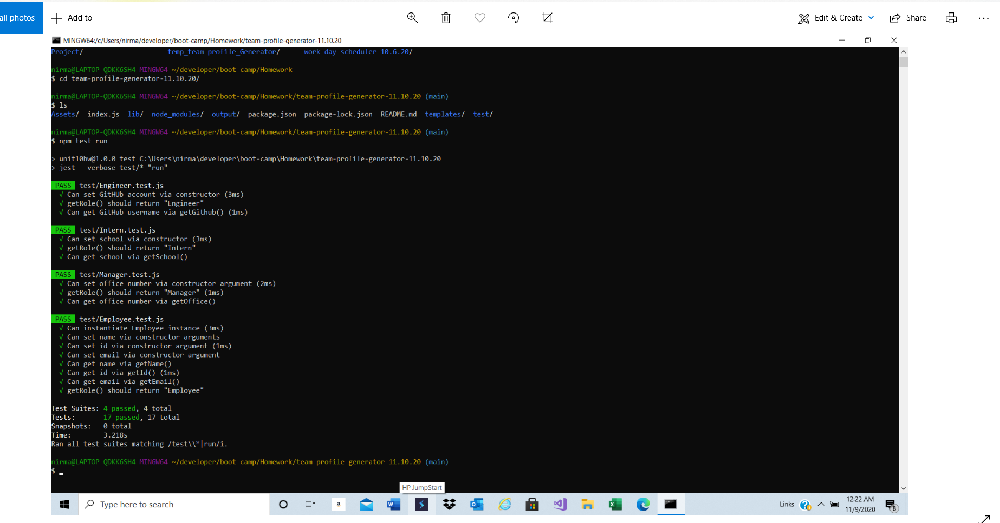

# team-profile-generator-11.10.20

## About The Project

---

Implemented the code for Team Profile Generator from COmmand Line Interface
This application allows user to add team members to team profile page.
First applicatin prompts to user the following questions:

-    Manager's name
-    Id
-    E-mail address
-    Office Number

Next application provides choice to user to add more team members to team,
user can add the following team members to team:

-    Engineer
-    Intern
-    Teamcompleted

If user select Engineer to add to team then
applicatin prompts to user the following questions:

-    Engineer's name
-    Id
-    E-mail address
-    Github username

If user select Intern to add to team then
applicatin prompts to user the following questions:

-    Intern's name
-    Id
-    E-mail address
-    School name

If user select TeamCompleted option from the list
then application exit and will create the team profile.

## Built With

Node modules

-    Inquirer : to prompts the user with questions
-    fs : to interact with I/O file system
-    path : to create the directory
-    css " to style the team html page
-    classes and inheritance : to crete the Emplyoee's objects(Manager,Engineer,and Intern)

## Getting Started

To get a local copy up and running follow below steps.

## Prerequisites

None

## Installation

Clone the repo
git clone git@github.com:NirmalaAbothu/team-profile-generator-11.10.20.git

## Credits

Followed the documentation about classes,inheritance and node js

## License & copyright

Copyright © 2020 Nirmala Abothu
